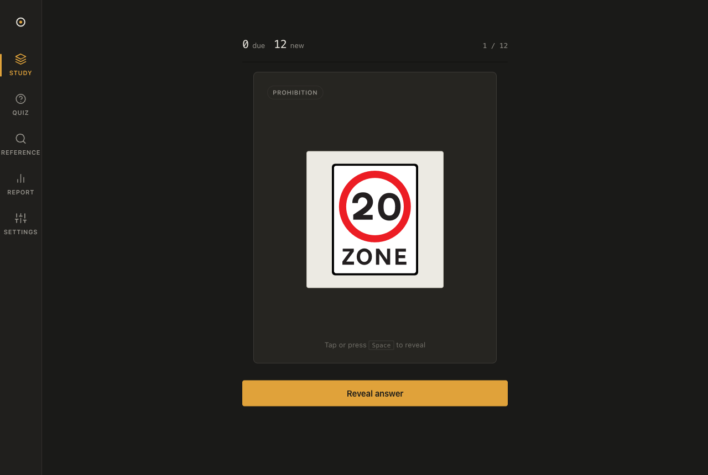
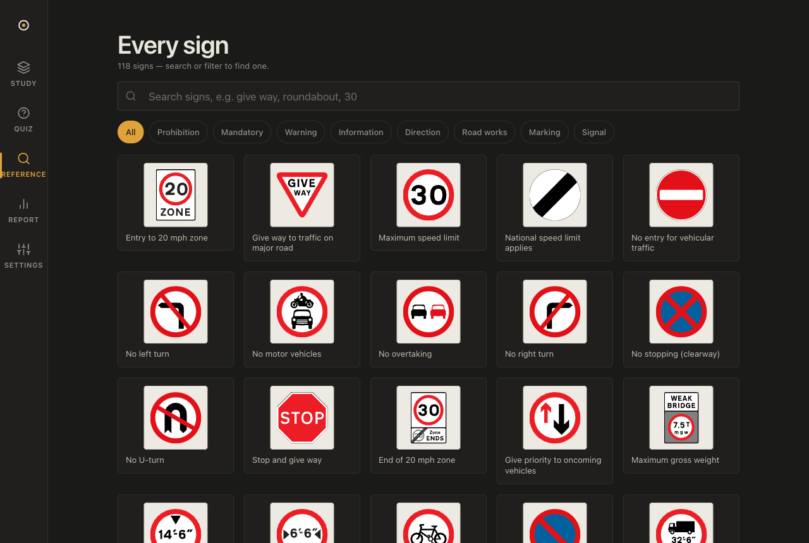

# Road Signs — CBT Revision

A focused, offline-capable web app for **spaced-repetition revision of the UK motorcycle
CBT road signs** — the official Highway Code sign set (motorway content excluded for now),
wrapped in a Dieter-Rams-inspired design system.


<p align="center">
  
  
</p>

Everything runs client-side. Progress lives in `localStorage` (with export/import and a
durable-storage request) — **no backend, no accounts, no tracking.**

## Features

- **Study** — spaced-repetition flip-cards. You answer **Got it / Missed**; the *Hard /
  Good / Easy* shade is **inferred from your recall speed** relative to your own pace.
- **Quiz** — auto-graded multiple choice whose wrong options are drawn from genuine
  **look-alike signs** (e.g. *no entry* vs *no motor vehicles*), so every question drills
  a real confusion.
- **Reference** — searchable, filterable index of **all 118 signs** with a detail sheet.
- **Report** — recall accuracy, 30-day retention, mastery, a per-category breakdown, and
  your **best- and worst-performing signs** with a one-tap *"drill these."*
- First-class **dark mode**, full **keyboard** control, **reduced-motion** support, and a
  **PWA** for offline study on the bus.

## How it learns

The scheduler is a small **SM-2-lite** algorithm (`src/lib/scheduler.ts`): four grades
(Again / Hard / Good / Easy) drive a per-card ease factor and interval.

You never grade on a 4-point scale, though. In **Study** you only judge *correctness*
(the one thing you're uniquely able to judge); the difficulty shade comes from **time**
(`src/lib/pace.ts`). Crucially it's **relative to your own rolling baseline**, not absolute
seconds — so the same 4-second recall reads as *Easy* for a slower learner and *Hard* for a
fast one. Looking away (idle) and corrupt timings are handled defensively so they can't
skew the schedule. The **Quiz** feeds the same adaptive model from its own baseline.

## The sign set

**118 signs** — 97 enabled by default (the core + standard non-motorway set) plus ~21
rarer "edge" signs you can toggle on. Artwork is **101 official OGL-licensed SVGs** sourced
from Wikimedia Commons, plus **17 in-app composites** (traffic-light sequence, road
markings, worded direction panels) drawn directly. Motorway signs are intentionally out of
scope but retained behind a flag for a future version.

## Privacy & your data

- **Local-only**: state is a single `localStorage` blob (reviews, settings, daily sessions,
  adaptive baselines). The app never makes a network request after load.
- **Durable**: on launch it requests persistent storage so the browser won't evict your
  progress; Settings shows the storage status.
- **Portable**: Settings → *Export* downloads a dated JSON backup; *Import* fully restores
  it on another browser/device. A gentle nudge reminds engaged users to back up.
- **Robust**: the loader/importer sanitises every entry, so a partial, old, or hand-edited
  backup can never crash or wedge the app.

## Tech stack

Svelte 5 (runes) · Vite · TypeScript (strict) · GSAP for motion · `vite-plugin-pwa` ·
Vitest. No UI framework runtime beyond Svelte; the learning engine is plain, pure,
unit-tested TypeScript.

## Getting started

```bash
npm install
npm run dev        # http://localhost:5173
npm test           # unit tests (scheduler / pace / stats / quiz / backup / persistence)
npm run check      # svelte-check (types) — kept at 0 errors / 0 warnings
npm run build      # production build → dist/
npm run preview    # serve the production build
```

Run a single test file or by name:

```bash
npx vitest run tests/scheduler.test.ts
npx vitest run -t "Easy graduates"
```

## Regenerating content & assets

The shipped data is generated — edit the sources, not the output.

```bash
npm run build-signs     # rebuild src/data/signs.ts from src/data/_gen/*.json (+ clusters)
npm run fetch-assets    # download OGL sign SVGs from Wikimedia → src/assets/signs/
npm run resolve-assets  # repair filenames fetch-assets couldn't find (Commons API)
npm run gen-icons       # regenerate PWA icons → public/icons/
```

> **Note:** `src/data/signs.ts` is auto-generated. To change content, edit
> `src/data/_gen/*.json` (and the `CLUSTERS` map in `scripts/build-signs.ts`), then
> `npm run build-signs`. See [`CLAUDE.md`](./CLAUDE.md) for the full architecture.

## Project structure

```
src/
  data/        signs.ts (generated) + _gen/*.json sources + sign SVGs
  lib/         the engine — scheduler, pace, deck, stats, quiz, search,
               persistence, storage, backup, store (Svelte 5 runes), motion (GSAP)
  components/  SignPlate, Flashcard, RecallBar, QuizCard, BackupNudge, …
  views/       Study, Quiz, Browse, Report, Settings
  styles/      tokens.css (the "Strata" design system) + base.css
scripts/       build-signs, fetch-assets, resolve-assets, gen-icons
tests/         pure-logic unit tests (vitest)
```

## Quality

46 unit tests, 0 type/svelte-check errors, and **Lighthouse Accessibility / Best-Practices
/ SEO all 100** (mobile). Verified end-to-end across 320–1280px, light + dark, with Chrome
DevTools (flows, no console errors, no horizontal overflow, reduced-motion).

## Deploy

Deploy-ready for **both** targets:

- **GitHub Pages** — push to `main`; `.github/workflows/deploy.yml` builds with
  `DEPLOY_TARGET=gh-pages` (base path `/cbt-flashcards/`) and publishes via Pages.
- **Netlify** — connect the repo; `netlify.toml` builds `dist/` from root.

## Licence & attribution

App code is **MIT** (see [`LICENSE`](./LICENSE)). The road-sign artwork is Crown copyright,
reproduced from Wikimedia Commons under the **Open Government Licence v3.0** — see
[`src/assets/signs/ATTRIBUTION.md`](./src/assets/signs/ATTRIBUTION.md). Reproduced for
education; signs are shown accurately and unmodified.
